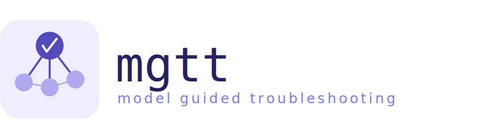

## Your architecture, executable.

Your architecture diagram is accurate the day it's drawn and lies a little more every day after. So when something breaks at 3am — and the person who built the system is asleep — you open three terminals and start guessing.

mgtt makes that diagram executable. You describe your system once in a single YAML model — components, dependencies, probes, what "healthy" means for each piece — and mgtt runs that one model two ways: as a test in CI (`mgtt simulate`) and as your incident responder at 3am (`mgtt diagnose`).

Same model both times — so it can't quietly drift out of sync with production. It's TDD for your architecture: every PR re-checks the model's reasoning, and every postmortem becomes a regression test the engine has to get right forever.

In detail, mgtt uses the model three ways:

- **At design time**, `mgtt simulate` feeds the engine scenarios — a broken component here, a healthy baseline there, a partial degradation somewhere in between — and asserts it reaches the right conclusion each time (including "everything's fine" when nothing is broken). It runs in CI on every PR, so architectural drift gets caught before the diagram silently starts lying to you. It also closes the feedback loop on the architecture itself — change a dependency, re-run the scenarios, see what breaks — which is, effectively, TDD for the architecture.
- **At 3am**, `mgtt diagnose` runs the same engine against the live system, with real probes replacing the synthetic facts. It names the broken component, eliminates the healthy ones, and hands you the chain from symptom to cause — instead of a Slack thread and a thousand educated guesses about which `kubectl` to try next.
- **After the dust settles**, `mgtt incident end --suggest-scenarios` turns the incident you just resolved into a YAML scenario patch — the exact failure chain you just fought through, ready to review and commit. Merge it, and the engine has to diagnose that situation correctly forever. Postmortems become regression tests; tribal knowledge stays in version control.

here is how:

**In CI**, the scenarios run on every PR:

```
$ mgtt simulate --all

  all components healthy                   ✓ passed
  api degraded, rds cold-cache             ✓ passed
  edge throttled, downstream healthy       ✓ passed

  3/3 scenarios passed
```

*Every scenario is a test of the model's reasoning. Rename `rds` and forget to update its dependency, and the PR that broke the model never merges.*

**At 3am**, you open an incident, diagnose it, and capture what you learned:

```
$ mgtt incident start

$ mgtt diagnose --suspect api

  ▶ probe nginx upstream_count       ✗ unhealthy
  ▶ probe api ready_replicas         ✗ unhealthy
  ▶ probe rds available              ✓ healthy  ← eliminated
  ▶ probe frontend ready_replicas    ✓ healthy  ← eliminated

  Root cause: api.degraded
  Chain:      nginx ← api
  Probes run: 4

$ mgtt incident end --suggest-scenarios

  wrote .mgtt/pending-scenarios/INC-0042.patch — merge into scenarios.yaml
```

*You didn't need to know the system — the model knew it for you. Partial visibility (RBAC refusals, transient throttles) surfaces as a flag, not an abort. The patch at the end turns what just happened into a scenario the engine has to diagnose correctly forever.*

## Architecture



mgtt core reasons; adapters translate to backend-specific commands; the registry publishes them. Credentials live only in the adapter layer — the engine never touches them. See [How It Works](./docs/concepts/how-it-works.md#architecture-at-a-glance) for the surrounding prose.

<!-- Source: docs/images/architecture.d2 — regenerate with `d2 docs/images/architecture.d2 docs/images/architecture.svg` -->


## Install

```bash
curl -sSL https://raw.githubusercontent.com/mgt-tool/mgtt/main/install.sh | sh
```

Or: `go install github.com/mgt-tool/mgtt/cmd/mgtt@latest`

## Quick start

```bash
mgtt init                          # scaffold system.model.yaml
mgtt model validate                # check the model
mgtt simulate --all                # run scenarios (in CI)
mgtt diagnose --suspect api        # troubleshoot a live system
```

## Docs

- [Quick Start](./docs/getting-started/quickstart.md) — end-to-end in five minutes
- [Blue/green storefront worked example](./docs/examples/blue-green-storefront.md) — 20-component real system, five scenarios, lessons from real use
- [How It Works](./docs/concepts/how-it-works.md) — the constraint engine
- [Docs site](https://mgt-tool.github.io/mgtt) — reference, providers, specs

## For TLA+ users

TLA+ checks your design; mgtt checks your running system.

## Contributing

Patches welcome — [CONTRIBUTING.md](./CONTRIBUTING.md). One click on the contributor agreement covers everything you send; you keep the copyright in your own work.

## License

Copyright (C) 2026 Alex Kunich. Dual-licensed: engine + CLI under [AGPL-3.0](LICENSE); provider SDK under [Apache-2.0](sdk/provider/LICENSE), so a provider author never inherits the engine's reciprocity. Every source file carries the SPDX identifier that governs it; see [NOTICE](./NOTICE).
