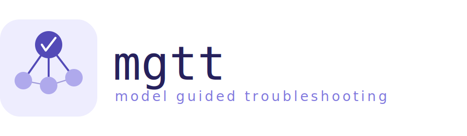

## Your architecture, executable.

Architecture diagrams go stale, and at 3am the person who drew one is asleep. mgtt replaces the diagram with a YAML model of your system: components, what each depends on, and what "healthy" means for each. One engine then reasons over that model at every stage:

1. **In CI**, `mgtt simulate` feeds the engine failure scenarios and asserts it blames the right component. If a change breaks the model's reasoning, the PR fails. No cluster or credentials needed.
2. **At 3am**, `mgtt diagnose` runs the same engine on live probes. It names the root cause, rules out healthy components, and says what it couldn't see. Run it yourself, or let an AI agent drive it over MCP. An agent can also draft the model for you.
3. **After the incident**, `mgtt incident end --emit-scenario` writes what was observed as a new scenario. Commit it, and CI checks that diagnosis on every future PR.

The model is tested like code, and each incident adds a test.

```
$ mgtt simulate --all
  all healthy                              ✓ passed
  api crash-loop, rds healthy              ✓ passed
  rds down                                 ✓ passed

  3/3 scenarios passed
```

## Install

```sh
curl -sSL https://raw.githubusercontent.com/mgt-tool/mgtt/main/install.sh | sh   # MGTT_VERSION=v0.3.0 to pin
go install github.com/mgt-tool/mgtt/cmd/mgtt@latest
docker run --rm -v "$PWD:/workspace" ghcr.io/mgt-tool/mgtt:latest version
```

## Docs

- [Quick start](docs/getting-started/quickstart.md): model, simulate, diagnose and retrospective, in ten minutes
- [AI agents (MCP)](docs/guides/agents.md): let Claude Code or another agent run the diagnosis
- [How it works](docs/concepts/how-it-works.md)
- [Docs site](https://mgt-tool.github.io/mgtt)

## Examples

- [`storefront`](examples/storefront/): a shop on EKS and AWS, blue/green behind one Service. Ten scenarios, one of them a queue consumer failing where only the background-jobs process sees it.
- [`redundant-web`](examples/redundant-web/): two web Deployments as a redundancy group. One down is degraded; the database under both is the root cause.
- [`minishop`](examples/minishop/): two components and a drifted copy, small enough to check by hand that verification with [writ](https://github.com/mgt-tool/mgtt2writ) catches the drift.

## License

Copyright (C) 2026 Alex Kunich. Engine and CLI: [AGPL-3.0](LICENSE). Provider SDK: [Apache-2.0](sdk/provider/LICENSE), so provider authors don't inherit the engine's terms. See [NOTICE](NOTICE). Contributions: [CONTRIBUTING.md](CONTRIBUTING.md).
