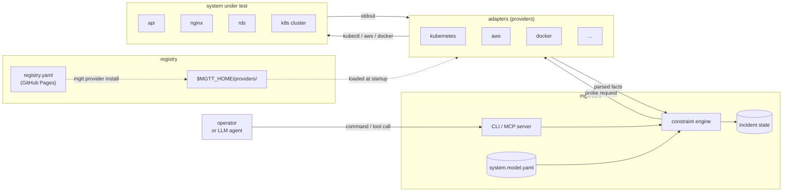

# How It Works

mgtt encodes your system's dependency graph in a YAML model. A constraint engine walks the graph, probing components and eliminating healthy branches until one failure path remains.

The same model and engine serve two phases — the only difference is where facts come from.

## Architecture at a glance



Four things, three flows:

- **mgtt core** owns the engine, the model, and the incident state. It is pure reasoning — no credentials, no backend SDKs.
- **Adapters** (providers) are plugins that translate engine-level probe requests into backend-specific commands and parse the output back into typed facts. One per technology: kubernetes, aws, docker, terraform, tempo, quickwit, or your own.
- **Registry** is the published index (`registry.yaml`) of available providers. `mgtt provider install` pulls a provider from the registry (git or image) into `$MGTT_HOME/providers/` where the runtime discovers it.
- **System under test** is the real thing — the pods, databases, load balancers your model claims to describe. The adapters touch it; mgtt core never does.

Facts flow engine → adapter → SUT → adapter → engine. Operators (human or LLM) talk to mgtt core via the CLI or the MCP server, never directly to adapters or the SUT.

## On this page

- [Architecture at a glance](#architecture-at-a-glance) — mgtt core, adapters, registry, system under test
- [The three artifacts](#the-three-artifacts) — model, facts, providers
- [The constraint engine](#the-constraint-engine) — how reasoning narrows the search
- [Two modes, same model](#two-modes-same-model) — design-time vs runtime
- [Probe ranking](#probe-ranking) — what to check next, and why
- [Providers](#providers) — where backend knowledge lives

---

## The three artifacts

```
system.model.yaml       you write once, version controlled
system.state.yaml       mgtt writes during incidents, append-only
providers/              community plugins, one per technology
```

The model describes the system. The state file records observations. Providers supply the vocabulary (types, facts, states) and the commands to collect facts from live systems.

## The constraint engine

The engine is mgtt's core. It takes four inputs:

1. **Components** — from the model
2. **Failure modes** — from the providers
3. **Propagation rules** — from the dependency graph
4. **Current facts** — from scenarios (simulation) or live probes (troubleshooting)

It produces a **ranked failure path tree**: which paths are still possible, which are eliminated, and which single probe would narrow the search the most.

The engine is pure — no I/O, no credentials, no side effects. The same engine powers both `mgtt simulate` and `mgtt diagnose`. Only the source of facts differs.

For the full internals (strategies, probe-selection heuristics, termination conditions, complexity math), see the **[Engine Reference](../reference/engine.md)**. This page stays at concept level.

## Two modes, same model

| | Simulation | Troubleshooting |
|---|---|---|
| Command | `mgtt simulate` | `mgtt diagnose` |
| Facts from | Scenario YAML (authored) | Live probes via installed providers |
| Needs | Nothing | Environment credentials |
| Runs in | CI pipeline | On-call laptop, CI job, Slack bot, or AI agent |
| Output | Pass/fail assertions | Structured root-cause report |

### Simulation (`mgtt simulate`)

You author scenario files that inject synthetic facts. The engine reasons over them and you assert the conclusion. This tests the **model's reasoning**, not the system's behavior.

```
model.yaml + scenario.yaml → engine → pass/fail
```

If someone removes a dependency from the model, the scenario fails. The PR is blocked. The blind spot never reaches production.

[Full simulation walkthrough →](simulation.md)

### Troubleshooting (`mgtt diagnose`)

The engine walks the dependency graph from the outermost component inward. At each step it picks the single highest-value, lowest-cost probe, runs it, and continues until one failure path remains or the probe budget is hit.

```
model.yaml + live probes → engine → root cause
```

`mgtt plan` is the interactive press-Y variant for debugging models or teaching — same engine, prompts at each step.

[Full troubleshooting walkthrough →](troubleshooting.md)

## Probe ranking

Not all probes are equal. The engine ranks each candidate by:

1. **Information value** — how many failure paths does this probe eliminate?
2. **Cost** — how expensive/slow is this probe? (low/medium/high, declared by the provider)
3. **Access** — what credentials or permissions does it need?

The engine always suggests the probe that eliminates the most uncertainty for the least cost. See [Engine Reference — Probe selection heuristics](../reference/engine.md#probe-selection-heuristics) for the exact algorithm.

## Providers

Providers teach mgtt about technologies. Each provider defines:

- **Types** — component types (e.g., `deployment`, `rds_instance`)
- **Facts** — observable properties per type (e.g., `ready_replicas`, `available`)
- **States** — derived from facts (e.g., `live`, `degraded`, `stopped`)
- **Failure modes** — what downstream effects each non-healthy state can cause
- **Probes** — the actual commands to collect facts from live systems

Providers for each technology are installed separately. See the [Provider Registry](../reference/registry.md) for the current catalog — Kubernetes, AWS, Docker, Terraform, Tempo, Quickwit, and anything else the community has authored. Writing your own is a [standalone guide](../providers/overview.md).

[Provider Type Catalog →](../reference/type-catalog.md) | [Writing Providers →](../providers/overview.md)
