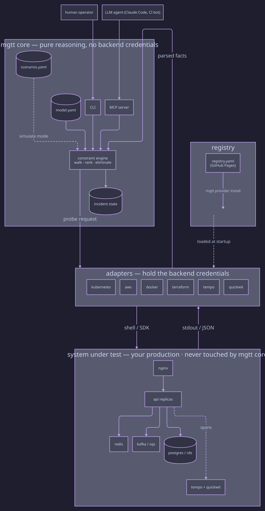

# How it works

The **engine** only reasons. It has no network access and no credentials. **Providers** do the probing: each one knows a backend (kubectl, the AWS CLI, Docker, …) and turns its output into typed facts. You install them from the [registry](../reference/registry.md). People and CI use the CLI; agents use [MCP](../guides/agents.md). Neither reaches a backend except through a provider.

## The model

- **Components** have a provider **type**. The type supplies **facts** (observable values such as `ready_replicas`), **states** derived from those facts (`crashed: restart_count > 5 & ready_replicas < desired_replicas`), default **healthy** rules, and **failure modes**, meaning which downstream effects each bad state can cause.
- **Dependencies** carry those effects: `api` depends on `rds`, so `rds.stopped` can cause `api.crashed`. A dependency can be conditional (`while: selector_value == blue`), or a redundancy group (`on: [web-a, web-b]`, `need: 1`) that holds while enough members are healthy.

## Failure chains

Every failure the model allows is a chain, `root state → effect → … → symptom`. `mgtt model validate --write-scenarios` saves them to `scenarios.yaml` in compact form: the graph of failure states, not one entry per chain. Even a 20-component model fits in about 10 KB. Commit the file. Validate rejects a stale copy, so a model change and its consequences land in the same diff. The number of chains grows with depth, not component count: about 270k for six tiers of fan-out 2, and about 350M for ten. Diagnosis, `validate` and `model diff` count and rank them over the graph without listing them, so a probe decision on ten tiers takes about 0.1 s. Only the commands that check chains one by one, such as `simulate --from-scenarios`, still list them.

## Diagnose: narrowing to one chain

Every chain starts out possible. After each probe the engine discards the chains that contradict what it saw, then picks the next probe:

1. it prefers the shortest chains still possible (fewest moving parts);
2. among those, chains that touch a `--suspect` come first;
3. it prefers the probe that rules out the most other chains;
4. it walks a chain from the symptom inward.

It stops when one chain remains (the root cause), when none remain (the failure isn't in the model; `--suggest-scenarios` will say so), or when the probe budget or deadline runs out. The trail of facts is saved to the incident, so you can pause a session and pick it up later.

## Simulate: same engine, injected facts

`mgtt simulate` runs exactly this reasoning over facts from a scenario file instead of probes. That's why a passing scenario counts as evidence about 3am: the code that passes the test is the code that will run the incident. `mgtt simulate --from-scenarios` goes further and checks that the engine identifies every enumerated chain from its own symptoms.

## What the engine won't assume

- **Unknown is not healthy.** A probe that is refused (`forbidden`) or times out (`transient`) leaves its component in play. The report lists it under `Cannot rule out`, and the result is flagged as partial visibility.
- **Missing is a failure.** If every probe of a component returns `not_found`, the component is absent, and the report names it as missing.
- **Redundancy isn't an outage.** A failed member of a group that still holds is reported as `Redundancy degraded`, not as the root cause.

Scenarios can assert each case with `unresolved:`, `cannot_rule_out:`, `not_eliminated:` and `redundancy_degraded:`.

## Beyond scenarios

Scenarios check the failures you wrote down. To check every reachable configuration for contradictions, use `mgtt model export`: it emits the fully resolved model as JSON for external checkers, such as [mgtt2writ](https://github.com/mgt-tool/mgtt2writ).
