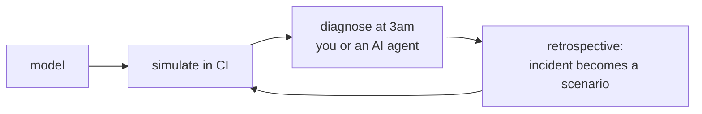

Architecture diagrams go stale, and at 3am the person who drew one is asleep. **mgtt turns that diagram into a YAML model and runs one engine over it at every stage of a system's life.**



## Model

You list components, what each depends on, and what healthy means. Types come from providers (Kubernetes, AWS, Docker, Terraform, Tempo, Quickwit), so a `kubernetes.deployment` already knows its facts and how to probe them.

```yaml
components:
  api:
    type: kubernetes.deployment
    depends:
      - on: rds
  rds:
    type: aws.rds_instance
```

## Simulate in CI

A scenario injects facts and states the expected conclusion: *"rds is down and api is crash-looping. Blame rds, not api."* `mgtt simulate` checks the engine agrees. It needs no cluster and no credentials. If someone drops a dependency or a health rule, the PR fails before the model can mislead anyone in an incident.

```
$ mgtt simulate --all
  api crash-loop, rds healthy              ✗ FAILED
    expected: root_cause=api path=[nginx, api] eliminated=[rds, frontend]
    actual:   root_cause=api path=[nginx, api] eliminated=[frontend]
```

## Diagnose at 3am

`mgtt diagnose` runs read-only probes against the live system and keeps narrowing until one failure chain is left:

```
Root cause: rds
Scenario:   rds.stopped → api.crashed → nginx.degraded
Probes run: 7/20   Time: 3.2s/5m0s
```

It doesn't need the person who built the system, because the model already holds that knowledge. When a probe is refused (RBAC, IAM) or times out, the report says `Cannot rule out: rds`. It never counts what it couldn't see as healthy.

**AI agents** get the same engine over MCP. You set the limits: read-only providers only, a cap on probes per incident, and whether write-capable probes pause or are refused. See [AI agents](guides/agents.md).

## Retrospective

```
$ mgtt incident end --emit-scenario
wrote scenarios/inc-20261004-0814-001.yaml — passes; commit it to keep this diagnosis under test
```

The facts mgtt saw during the incident become a scenario. After you commit it, every future PR must still produce that diagnosis.

**Start:** [Quick start](getting-started/quickstart.md) · [How it works](concepts/how-it-works.md)
